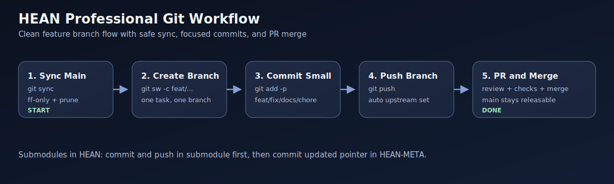
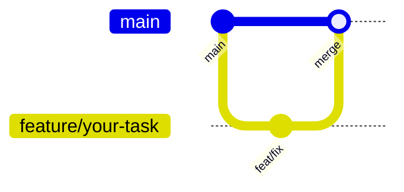

# HEAN

Production-grade, event-driven crypto trading system for Bybit Testnet. All trades execute on testnet with virtual funds.

## System Overview

HEAN is a fully autonomous trading engine built around an async event bus architecture. Market data flows from Bybit WebSocket through a deterministic filter cascade, risk management, and execution pipeline — all in real-time.

**Stack:**
- **Backend:** Python 3.11 / FastAPI / async event bus / DuckDB
- **Exchange:** Bybit Testnet (HTTP + WebSocket)
- **iOS App:** SwiftUI (iOS 17+) — Command Center with 5 tabs
- **AI:** Claude Brain for periodic market analysis
- **Monitoring:** Prometheus + Grafana (optional)

## Visual Git Workflow

Professional Git process for this monorepo is documented here:

- `docs/GIT_WORKFLOW.md`
- `docs/assets/git/README.md` (where to place GIF/screenshots)





## Architecture

```
Bybit WebSocket (ticks, orderbook, funding)
          │
          ▼
    ┌─────────────┐
    │  Event Bus   │ ◄── Priority queues + fast-path dispatch
    └──────┬──────┘      (SIGNAL, ORDER_REQUEST, ORDER_FILLED)
           │
     ┌─────┼─────────────────────────────────────┐
     │     │     │          │          │          │
     ▼     ▼     ▼          ▼          ▼          ▼
 Strategies Risk  Execution Portfolio Physics   Brain
     │     │     │          │          │          │
     │     │     ▼          │          │          │
     │     │  Bybit HTTP   │          │          │
     │     │  (orders)      │          │          │
     └─────┴───────────────┴──────────┴──────────┘
```

**Signal chain (10 nodes):**
TICK → Strategy → 12-layer filter cascade → SIGNAL → RiskGovernor → ORDER_REQUEST → ExecutionRouter → Bybit → ORDER_FILLED → Position

## Strategies

| Strategy | Description |
|---|---|
| **ImpulseEngine** | Momentum-based with 12-layer deterministic filter cascade (70-95% rejection rate) |
| **FundingHarvester** | Funding rate arbitrage across perpetual contracts |
| **BasisArbitrage** | Spot-perpetual basis spread capture |
| **MomentumTrader** | Trend-following with regime awareness |
| **CorrelationArb** | Cross-asset correlation-based arbitrage |
| **EnhancedGrid** | Grid trading with dynamic spacing |
| **HFScalping** | High-frequency scalping on microstructure |
| **LiquiditySweep** | Liquidity pool sweep detection |
| **InventoryNeutralMM** | Market making with inventory management |
| **RebateFarmer** | Exchange fee rebate optimization |
| **SentimentStrategy** | Sentiment-driven trading signals |

## Risk Management

Graduated risk states: `NORMAL` → `SOFT_BRAKE` → `QUARANTINE` → `HARD_STOP`

- **RiskGovernor** — Centralized risk state machine with graduated responses
- **KillSwitch** — Hard stop on >20% drawdown from initial capital
- **PositionSizer** — Kelly criterion-based position sizing
- **DepositProtector** — Capital preservation floor
- **DynamicRisk** — Volatility-adjusted risk parameters
- **SmartLeverage** — Adaptive leverage management

## Physics Engine

Market thermodynamics analysis providing edge to strategies:

- **Temperature** — Market energy measurement via tick velocity
- **Entropy** — Information entropy of price distribution
- **PhaseDetector** — Market regime classification (accumulation, markup, distribution, markdown)
- **Szilard Engine** — Information-to-profit conversion (Maxwell's demon for markets)
- **ParticipantClassifier** — Whale/MM/retail flow identification
- **AnomalyDetector** — Statistical anomaly detection in real-time
- **TemporalStack** — Multi-timeframe analysis (5 levels)

## Council (AI Decision Layer)

Multi-agent AI council for trade review and strategic decisions:

- **Council** — Orchestrates multiple AI members for consensus
- **Members** — Specialized AI agents (risk reviewer, strategy advisor, etc.)
- **Introspector** — Self-analysis of system performance
- **Review** — Post-trade analysis and learning

## Quickstart

### Installation

```bash
make install
# or: pip install -e ".[dev]"
```

### Configuration

```bash
# Required in .env:
BYBIT_API_KEY=your-testnet-key
BYBIT_API_SECRET=your-testnet-secret
BYBIT_TESTNET=true
LIVE_CONFIRM=YES

# Optional:
INITIAL_CAPITAL=300          # Starting capital (USDT)
ANTHROPIC_API_KEY=your-key   # Enables Claude Brain analysis
BRAIN_ENABLED=true           # AI analysis on/off
MULTI_SYMBOL_ENABLED=false   # Multi-symbol scanning
```

Get testnet API keys at https://testnet.bybit.com/

### Run

```bash
# CLI mode
make run
# or: python3 -m hean.main run

# Development (API + monitoring)
make dev

# Docker
docker-compose up -d --build
```

### API

FastAPI backend on port 8000. Key endpoints:

| Endpoint | Description |
|---|---|
| `GET /health` | Health check |
| `GET /api/v1/engine/status` | Engine state, equity, PnL |
| `GET /api/v1/orders/positions` | Open positions |
| `GET /api/v1/orders` | Active orders |
| `GET /api/v1/strategies` | Strategy list with status |
| `GET /api/v1/risk/governor/status` | Risk state + reason codes |
| `GET /api/v1/risk/killswitch/status` | Killswitch status |
| `GET /api/v1/trading/why` | Diagnostic: why is/isn't system trading |
| `GET /api/v1/trading/metrics` | Signal/order/fill counters |
| `GET /api/v1/physics/state?symbol=X` | Temperature, entropy, phase |
| `GET /api/v1/physics/participants?symbol=X` | Whale/MM/retail breakdown |
| `GET /api/v1/physics/anomalies?limit=N` | Active anomalies |
| `GET /api/v1/temporal/stack` | Multi-timeframe levels |
| `GET /api/v1/brain/analysis` | Latest AI market analysis |
| `GET /api/v1/council/status` | Council decision status |
| `POST /api/v1/engine/start` | Start engine |
| `POST /api/v1/engine/stop` | Stop engine |

WebSocket at `ws://localhost:8000/ws` with topics: `system_status`, `order_decisions`, `ai_catalyst`.

### iOS App

SwiftUI app in `ios/`. Open `ios/HEAN.xcodeproj` in Xcode.

**Command Center tabs:** Live, Mind, Action, X-Ray, Settings

Connects to FastAPI backend via actor-based `APIClient`. All models use `CodingKeys` for snake_case → camelCase mapping.

## Testing

```bash
make test                    # All tests (671)
pytest tests/test_api.py -v  # Specific file
pytest -k "impulse" -v       # Pattern match
```

## Project Structure

```
src/hean/
├── main.py                 # CLI + TradingSystem orchestrator
├── config.py               # Pydantic v2 settings
├── core/
│   ├── bus.py              # Async EventBus (priority queues, circuit breaker)
│   └── types.py            # Event types, Tick, Signal, Order, Position
├── strategies/             # 11 trading strategies + filters
├── risk/                   # RiskGovernor, KillSwitch, PositionSizer, Kelly
├── execution/              # Order routing (router_bybit_only.py = production)
├── exchange/bybit/         # HTTP + WebSocket clients
├── portfolio/              # Accounting, allocation, profit capture
├── physics/                # Market thermodynamics engine
├── brain/                  # Claude AI analysis
├── council/                # Multi-agent AI decision layer
├── storage/                # DuckDB persistence
├── agent_generation/       # LLM-powered agent generation
├── backtest/               # Backtesting engine
├── symbiont_x/             # Genetic algorithm strategy evolution
└── api/                    # FastAPI server + routers

ios/HEAN/
├── App/                    # App entry point
├── Core/                   # DI, Networking (APIClient, Endpoints)
├── Models/                 # Codable models
├── Features/               # Live, Mind, Action, XRay, Settings, Dashboard...
├── DesignSystem/           # Colors, typography, formatters
└── Services/               # Consolidated service layer
```

## Docker

```bash
docker-compose up -d --build    # Build and start
docker-compose logs -f          # View logs
docker-compose down             # Stop

# Production with monitoring
make prod-with-monitoring       # + Prometheus + Grafana
```

Services: `hean-api` (8000), `hean-redis` (6379)

## Safety

- **Testnet only** — All trades use virtual funds, zero real money at risk
- **KillSwitch** — Auto-stops on >20% drawdown
- **Graduated risk** — NORMAL → SOFT_BRAKE → QUARANTINE → HARD_STOP
- **Deterministic filters** — 12-layer cascade, no bypasses in any mode
- **DRY_RUN=true** default — Must explicitly enable real order execution

## License

MIT
