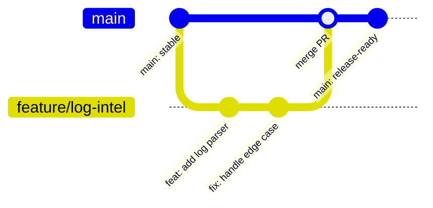
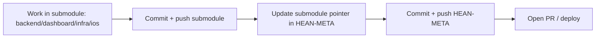

# Git Workflow (Visual + Practical)

This guide explains a clean, professional Git process for this monorepo and its submodules.


## 1) Visual Flow (Main + Feature Branch)



## 2) Visual Flow (Monorepo + Submodules)



## 3) Fast Daily Loop

```bash
# 1) Sync
git sync

# 2) Branch
git sw -c feat/short-name

# 3) Work + check
git st

# 4) Stage/commit
git add -p
git commit -m "feat: short, clear message"

# 5) Push
git push
```

## 4) Commit Style (Recommended)

Use Conventional Commits:

- `feat: add log classifier`
- `fix: prevent websocket reconnect loop`
- `chore: update submodule pointer`
- `docs: add git workflow diagrams`
- `refactor: split api client config`

## 5) Submodule Workflow (Important for HEAN)

```bash
# inside submodule (example: dashboard)
git -C dashboard st
git -C dashboard add -A
git -C dashboard commit -m "fix: improve runtime api config"
git -C dashboard push origin main

# back to root
git add dashboard
git commit -m "chore: update dashboard submodule"
git push origin main
```

## 6) Visual Assets (GIF / Screenshots)

Store media here:

- `docs/assets/git/workflow-demo.gif`
- `docs/assets/git/before.png`
- `docs/assets/git/after.png`

Markdown example:

```md


```

Terminal animation recipe (optional):

```bash
# one command helper
bash docs/assets/git/make-demo-gif.sh
```

## 7) Safe Rules

- Keep `main` fast-forward clean (`pull --ff-only` is enabled).
- Commit small logical chunks.
- Push submodule first, then root pointer.
- Never force-push shared `main`.
- Keep commit messages short and specific.
